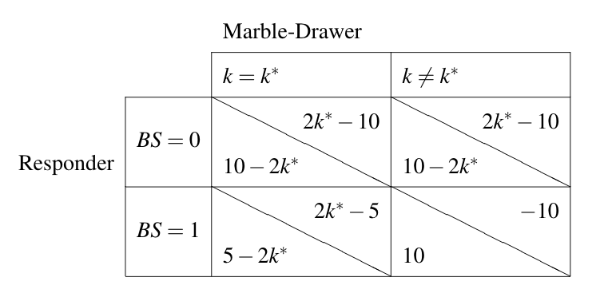
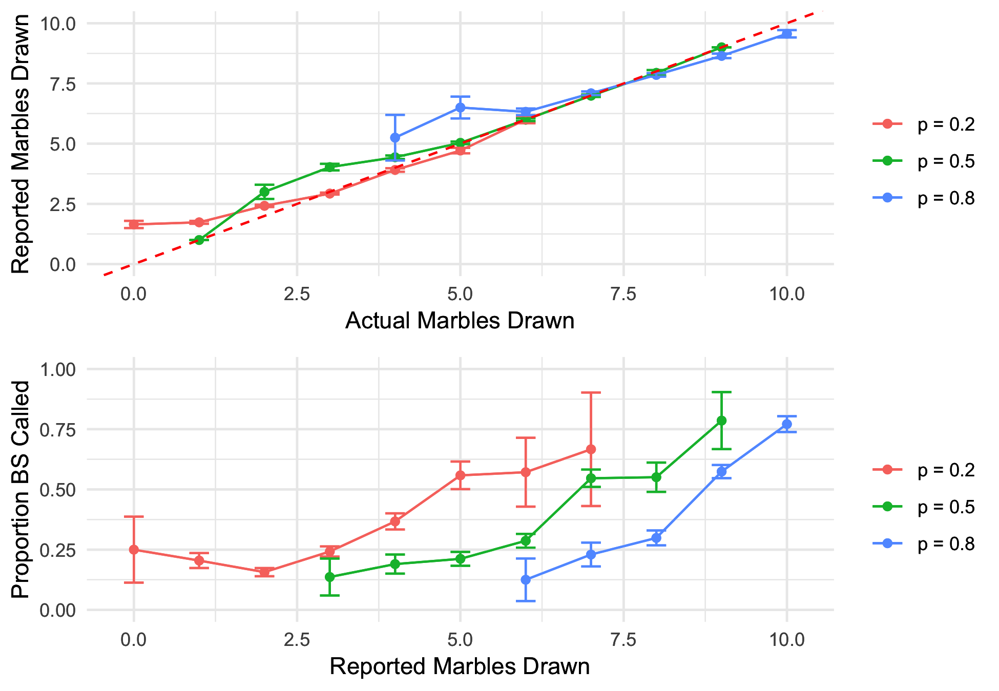
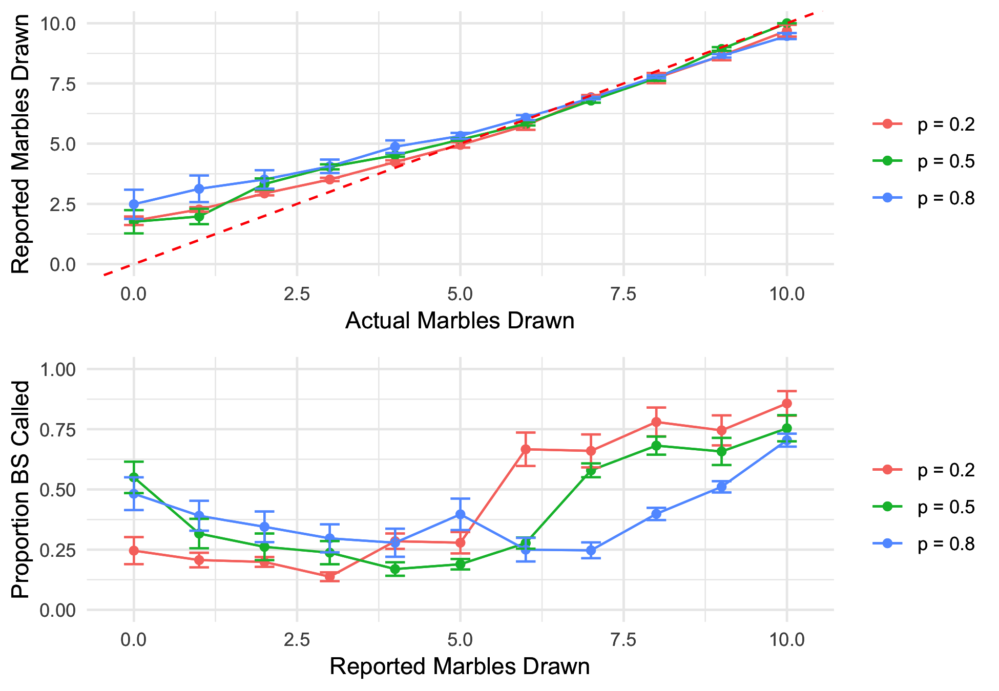

```{r setup, include=F, warning=F, message=F}
knitr::opts_chunk$set(echo = TRUE)
library(tidyverse)
library(gridExtra)
source("lying_modelFunctions.R")
```

# Intro #

How do humans choose what lies to tell? Research on improving our detection of deception has obvious implications for criminimal law. Similarly, in our modern era of concern for fake news, the layman can certainly benefit from understanding how to detect deception in all mediums. Previous research on deception has focused on the execution of lies, i.e. how do humans perform and perceptually detect lies. However, less research has focused on the content of lies, i.e. what do humans actually say when they tell lies.

To lie requires an understanding of what others might think. Children are renown for being bad liars due to their lack of theory of mind (Ding et al., 2015). However, even having a theory of mind or not does not explain why some lies are inherently better at deceiving than others. In our current study, we propose that good liars require social reasoning about whether their conversational partner would believe the lie to be detectable or not. By assuming the other agent is also rational and reasoning about the other agent, humans generate lies that balance gain (i.e. the lie is strong) and feasibility (i.e. the lie is realistic). In this study, we developed a novel lying game. We then developed a recursive Bayesian model in which liars perform inference based on the likelihood the lie detector would call BS given the stated lie, while lie detectors perform inference based on the likelihood the liar would say a given lie given each of the possibilities about the true state of the world.

# Game #

We developed a novel dyadic lying game in which one player (L) draws marbles (red and blue) from an urn and they report a number of red marbles corresponding to how much they'd like the other player (D) to think they drew. Critically D has the option to accept or call BS about the number reported. If L lies, L gets penalized; if D calls BS when in fact L tells the truth, D gets penalized. However, the higher value L reports and gets away with, the more beneficial it is for him. The payoffs conditioned on each outcome are shown in Figure 1.

In this game, we also vary the probability of drawing a red marble (p) {0.2, 0.5, 0.8}, and this manipulation allows us to observe how players consider the priors about the world when making lying and lie detecting decisions.




# Model #

The model functions are in "lying_modelFunctions.R" which is sourced here. Formally, the model appears as follows.

Probability of actions followed a Luce choice rule, which placed a softmax on expected utility modulated by an $\alpha$ paramter. In this model, we set $\alpha$ to 0.25, suggesting that humans make their decision "pretty softly", allowing for more equal probability to be assigned compared to a hardmax rule, or even a softmax rule with $\alpha = 1$. For example, when given the choice of expected utility of 10 or 8, they may in fact choose 8 with a non-zero probability. 
$$P(A) = \mathop{softmax}_{A}(EU[A]) = \frac{\exp(\alpha EU[A])}{\sum_{A'}\exp(\alpha  EU[A'])}$$

The probability D calls BS based on $k^*$ with a softmax over expected utility for calling BS and not calling BS.

$$P_D(BS \mid k^*) = \mathop{softmax}_{BS}(EU_D[BS \mid k^*])$$
The expected utility for D is determined by the payoff for each outcome and the probability of the outcome given $k^*$, marginalizing over whether the $k^*$ L provided was true or false.

$$EU_D[BS \mid k^*] = \sum_{T} U_D(BS ; k^*, T) P(T \mid k^*)$$

The probability of a lie or truth condition on $k^*$ is then normalized.

$$P(T \mid k^*) = P(k^*=k \mid k^*) =\frac{ \sum_k P(k) P_L(k^*\mid k)  P(k = k^* \mid k, k^*)}{\sum_k P(k) P_L(k^*\mid k)}$$

Meanwhile, L makes his decision based on a softmax over his expected utility circulating through each $k^*$ value.

$$P_L(k^* \mid k) = \mathop{softmax}_{k^*}(EU_L[k^* \mid k])$$

L's expected utility is determined by marginalizing over utility given (accept or BS) outcomes multiplied by the probability of D calling BS or not.

$$EU_L[k^* \mid k] = \sum_{BS} U_L(k^* \mid BS, k^*=k) P_D(BS \mid k^*)$$

In order to make the recursion computable, we used a decay function (d) and base function, in which with probability d, D zeroes out and calls BS with the base distribution. The decay function can also be viewed as the probability of ending recursing, e.g. L or D gets lazy about thinking about the other agent and chooses an action without social reasoning. In this report, we vary the decay function {1, 0.5, 0.05} and the base distribution {cumulative binomial distribution, uniform distribution}. 

## Cumulative Binomial Base Function ##

We start with considering an intelligent base function of a cumulative binomial distribution. As this was the distribution with which the AI from our experiment calls BS, this seems like a very reasonable base function. Here we run 1000 simulations, varying $p$ and $d$. 

```{r simulate.cbinom, warning=F, message=F}
numSims = 1000
df.cbinom <- data.frame(role=factor(),
                      p=numeric(), 
                      decay=numeric(),
                      ks=numeric(), # ksay in Detector, k in Liar
                      n=numeric(),
                      val=numeric(),
                      se=numeric()) # prop in Detector, expLie in Liar

for(i in c(0.2, 0.5, 0.8)){
  for(j in c(1, 0.5, 0.05)){
    sim.D <- t(replicate(numSims, recurse.D(j, i, pbinom(0:10,10,i))))
    prop <- colMeans(sim.D)
    se <- prop * (1-prop) / sqrt(numSims)
    df.cbinom <- bind_rows(df.cbinom, data.frame(role="Detector", p=i, decay=j, ks=0:10, n=numSims, val=prop, se=se))
    
    sim.L <- t(replicate(numSims, exp.ksay(i, recurse.D(j, i, pbinom(0:10,10,i)))))
    expLie <- colMeans(sim.L)
    se <- apply(sim.L, 2, sd) / sqrt(numSims)
    df.cbinom <- bind_rows(df.cbinom, data.frame(role="Liar", p=i, decay=j, ks=0:10, n=numSims, val=expLie, se=se))
  }
}
```

```{r graph.cbinom, warning=F, message=F, fig.cap="**Fig. 2: Model simulated results using a cumulative binomial prior.**"}
lie.cbinom <- df.cbinom %>%
  filter(role=="Liar") %>%
  mutate(prob = paste("p =", p),
         decay.txt = factor(paste("decay =", round(decay,2)), levels=c("decay = 1", "decay = 0.5", "decay = 0.05"))) %>%
  ggplot(aes(x=ks, y=val, colour=prob)) +
  geom_line(alpha=0.8, size=1.25) +
  geom_errorbar(aes(ymax=val+se, ymin=val-se), alpha=0.8, width=0.5) +
  geom_abline(intercept = 0, slope = 1, colour="red", linetype=2) +
  ggtitle("Marble Drawer") +
  scale_x_continuous("Actual Marbles Drawn") +
  scale_y_continuous("Reported Marbles Drawn", limits=c(0,10)) +
  facet_wrap(~decay.txt) +
  theme_minimal()

detect.cbinom <- df.cbinom %>%
  filter(role=="Detector") %>%
  mutate(p = paste("p =", p),
         decay.txt = factor(paste("decay =", round(decay,2)), levels=c("decay = 1", "decay = 0.5", "decay = 0.05"))) %>%
  ggplot(aes(x=ks, y=val, colour=p)) +
  geom_line(alpha=0.8, size=1.25) +
  geom_errorbar(aes(ymax=val+se, ymin=val-se), alpha=0.8, width=0.5) +
  ggtitle("Responder") +
  scale_x_continuous("Reported Marbles Drawn") +
  scale_y_continuous("Proportion BS Called", limits=c(0,1)) +
  facet_wrap(~decay.txt) +
  theme_minimal()

grid.arrange(lie.cbinom, detect.cbinom, nrow=2)
ggsave("cbinom.png", grid.arrange(lie.cbinom, detect.cbinom, nrow=2))
```

We find that the model predicts that more lies will be told when the actual number of red marbles drawn is low, and more truths will be told when the actual number of red marbles drawn is high. Furthermore, this varies by $p$, where the threshold of when lies occur more increases as $p$ increases.

The model in lie detecting appears more logistic with higher decay values (makes sense as this was the base function), but becomes more sinusoidal with smaller decay as in the $d=0.05$ case.


## Uniform Base Function ##

To validate that it is the recursive reasoning that is doing most of the work and not simply the priors, we provide the model with a "dumb" base function that assumes D calls BS with a uniform distribution, in this case 0.1 across all reported marbles drawn. 

```{r simulate.unif, warning=F, message=F}

df.unif <- data.frame(role=factor(),
                      p=numeric(), 
                      decay=numeric(),
                      ks=numeric(), # ksay in Detector, k in Liar
                      n=numeric(),
                      val=numeric(),
                      se=numeric()) # prop in Detector, expLie in Liar

for(i in c(0.2, 0.5, 0.8)){
  for(j in c(1, 0.5, 0.05)){
    sim.D <- t(replicate(numSims, recurse.D(j, i, rep(0.1,11))))
    prop <- colMeans(sim.D)
    se <- prop * (1-prop) / sqrt(numSims)
    df.unif <- bind_rows(df.unif, data.frame(role="Detector", p=i, decay=j, ks=0:10, n=numSims, val=prop, se=se))
    
    sim.L <- t(replicate(numSims, exp.ksay(i, recurse.D(j, i, rep(0.1,11)))))
    expLie <- colMeans(sim.L)
    se <- apply(sim.L, 2, sd) / sqrt(numSims)
    df.unif <- bind_rows(df.unif, data.frame(role="Liar", p=i, decay=j, ks=0:10, n=numSims, val=expLie, se=se))
  }
}
```

```{r graph.unif, warning=F, message=F, fig.cap="**Fig. 3: Model simulated results using a uniform prior.**"}
lie.unif <- df.unif %>%
  filter(role=="Liar") %>%
  mutate(p = paste("p =", p),
         decay.txt = factor(paste("decay =", round(decay,2)), levels=c("decay = 1", "decay = 0.5", "decay = 0.05"))) %>%
  ggplot(aes(x=ks, y=val, colour=p)) +
  geom_line(alpha=0.8, size=1.25) +
  geom_errorbar(aes(ymax=val+se, ymin=val-se), alpha=0.8, width=0.5) +
  geom_abline(intercept = 0, slope = 1, colour="red", linetype=2) +
  ggtitle("Marble Drawer") +
  scale_x_continuous("Actual Marbles Drawn") +
  scale_y_continuous("Reported Marbles Drawn", limits=c(0,10)) +
  facet_wrap(~decay.txt) +
  theme_minimal()

detect.unif <- df.unif %>%
  filter(role=="Detector") %>%
  mutate(prob = paste("p =", p),
         decay.txt = factor(paste("decay =", round(decay,2)), levels=c("decay = 1", "decay = 0.5", "decay = 0.05"))) %>%
  ggplot(aes(x=ks, y=val, colour=prob)) +
  geom_line(alpha=0.8, size=1.25) +
  geom_errorbar(aes(ymax=val+se, ymin=val-se), alpha=0.8, width=0.5) +
  ggtitle("Responder") +
  scale_x_continuous("Reported Marbles Drawn") +
  scale_y_continuous("Proportion BS Called", limits=c(0,1)) +
  facet_wrap(~decay.txt) +
  theme_minimal()

grid.arrange(lie.unif, detect.unif, nrow=2)
ggsave("unif.png", grid.arrange(lie.unif, detect.unif, nrow=2))
```

We find that despite the uniform distribution when the model does not recurse at all, with even just an average of 1 level of recursion ($d=0.5), the pattern of lying already begins to resemble the pattern discussed in the previous section. The same is the case for lie detecting.

# Empirical Results #

Qualitatively our model seems to reflect our empirical results from our Experiment 3 and 4 (n=71, n=95). Experiment 3 is a between-subject manipulation of $p$. Building off Experiment 3, Experiment 4 does not provide feedback to participants and feeds participants some values for actual and reported marbles drawn that does not come from the distribution of the marbles. This was done in the hopes of seeing how participants perform when getting extreme values.





# Discussion #

In this analysis, we show that a recursive Bayesian model qualitatively captures the behavior of human liars and lie detectors. Furthermore, even with providing the model with a "dumb" uniform base function, the model performs fairly well, especially with higher levels of recursion. One important thing to note is that if a stronger "softmax" is used (i.e. more hard) the model does not qualitatively capture the pattern of the empirical data as well, where the base function seems to dominate and the predictions are more "spikey" (not shown here). This surprising nature of this model requires more consideration. 


